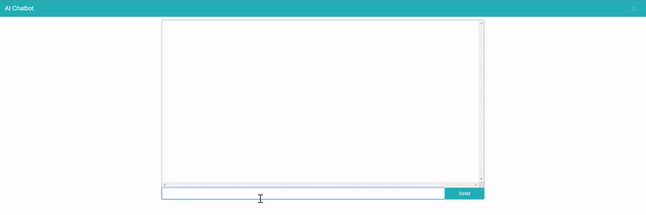

[![LinkedIn][linkedin-shield]][linkedin-url]

# Simple Chatbot
> A simple chatbot application built using chatterbot, flask and vue js.



## Table of Contents
  - [Introduction](#introduction)
  - [Getting Started](#getting-started)
    - [Clone](#clone)
    - [Installing dependencies](#installing-dependencies)
  - [Usage](#usage)
  - [Acknowledgements](#acknowledgements)
    - [Articles](#articles)
    - [Codes that were used](#codes-that-were-used)
    - [Dataset](#dataset)
  - [License](#license)


## Introduction
This is a simple ai chatbot project that uses chatterbot. Some additional functionalities are also added such as being able to get the current time and also get a wikipedia summary of a certain topic.

There are two ways the app can be run, either using the vue app where interactions with the bot is done through text or through a cli command where the bot can be interacted with speech. 

## Getting Started

### Clone
- Cloning repo to your local setup
```shell
$ git clone https://github.com/NurmanZahin/flask_vue_chatbot.git
```

### Installing dependencies
- Create a new conda environment using the environment.yml
- Install the frontend packages required
```shell
$ conda env create -f environment.yml
$ conda activate ai_chatbot
$ cd vue_chatbot
$ npm install
```

## Usage
- To try out the demo application for chatting via text, run the command below
- The demo app can be accessed using [http://localhost:8080](http://localhost:8080)

**Note: It may take some time to train the chatterbot.**
```shell
$ bash start_chatbot.sh
```
<br>

- To try out the demo application for chatting via speech, run the command below from the ai_assistant directory
```shell
$ python -m src.model
```


## Acknowledgements 
- [chatterbot](https://chatterbot.readthedocs.io/en/stable/)
- [chatbot frontend](https://github.com/syntacticsolutions/vue-chatbox-tutorial)
- [Virtual Assistant](https://www.activestate.com/blog/how-to-build-a-digital-virtual-assistant-in-python/)


[linkedin-shield]: https://img.shields.io/badge/-LinkedIn-black.svg?style=flat-square&logo=linkedin&colorB=555
[linkedin-url]: www.linkedin.com/in/nurman-jupri-20655814a
[product-screenshot]: images/screenshot.png